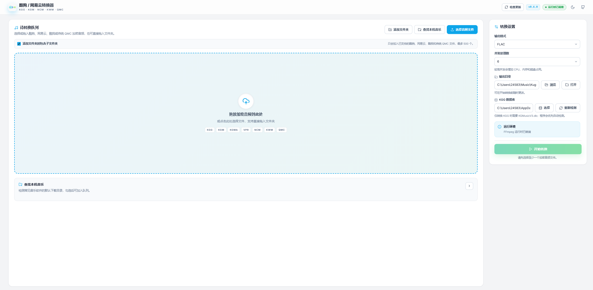

<div align="center">


# Kugo Music Converter

**一键批量解密酷狗、网易云、酷我、QQ 音乐的加密音频，转换为 MP3 / FLAC / WAV**

解密和转码全部在你的电脑上完成，音频文件不会发送到网络

[](https://github.com/skxxxkx666/Kugo-Music-Converter/releases/latest)
[](COPYING)
[](https://go.dev/)
[](#系统要求)
[](https://github.com/skxxxkx666/Kugo-Music-Converter/releases)

[下载最新版](https://github.com/skxxxkx666/Kugo-Music-Converter/releases/latest) · [功能特性](#功能特性) · [支持格式](#支持格式) · [常见问题](#常见问题)



</div>

支持把酷狗 **KGG / KGM / KGMA / VPR**、网易云 **NCM**、酷我 **KWM** 以及传统 QQ 音乐 **QMC** 系列转换为 MP3、FLAC、WAV 或原始音频格式。

## 推广

### ▶ 推荐机场 | FreedomPort

[FreedomPort —— 高性能全链路加速机场](https://www.freedomport.cc)

- **顶级骨干直连 + BGP 多线中转**：精选电信 CN2 GIA、联通 9929、移动 CMI 优质链路，全网智能容灾分流
- **海外专业团队运营**：多节点物理冗余架构，自动化健康巡检，持久稳定不跑路
- **超值优惠套餐**：100GB 流量仅需 9.9 元，超低门槛畅享企业级网络
- **全天候抗晚高峰**：千兆大带宽接入，极低延迟与零丢包，4K/8K 视频与大型项目秒速拉取
- **AI 与全球流媒体全解锁**：原生支持 ChatGPT、Claude、Cursor、GitHub Copilot 及 Netflix、Disney+ 等全生态
- **亲民高性价比套餐**：灵活流量配置，支持多端订阅（Clash / Sing-box / Karing / Surge）

👉 **官网直达**：[https://www.freedomport.cc](https://www.freedomport.cc)

## 版本状态

| 版本 | 状态 | 使用方式 |
|---|---|---|
| v0.5.1 | 历史稳定版 | 解压 ZIP，使用 `start.hta` 或 `start.bat` |
| v0.6.0 | 当前稳定版，全部发布验收已完成 | 安装器（推荐）或便携 EXE |

> v0.6.0 按当前决策保持未签名，并为每个正式 EXE 和安装器提供 SHA-256；SignPath Foundation 延后到 v0.6.1 评估。

## 下载当前稳定版

**当前稳定版本：v0.6.0**

| 文件 | 平台 | 说明 |
|---|---|---|
| [Kugo-Music-Converter-v0.6.0-windows-amd64-setup.exe](https://github.com/skxxxkx666/Kugo-Music-Converter/releases/download/v0.6.0/Kugo-Music-Converter-v0.6.0-windows-amd64-setup.exe) | Windows x64 | 标准安装器，推荐大多数用户 |
| [Kugo-Music-Converter-v0.6.0-windows-amd64.exe](https://github.com/skxxxkx666/Kugo-Music-Converter/releases/download/v0.6.0/Kugo-Music-Converter-v0.6.0-windows-amd64.exe) | Windows x64 | 标准便携版，使用系统 WebView2 |
| [Kugo-Music-Converter-v0.6.0-windows-amd64-webview2-setup.exe](https://github.com/skxxxkx666/Kugo-Music-Converter/releases/download/v0.6.0/Kugo-Music-Converter-v0.6.0-windows-amd64-webview2-setup.exe) | Windows x64 | 内置 WebView2 安装器，体积较大 |
| [Kugo-Music-Converter-v0.6.0-windows-amd64-webview2.exe](https://github.com/skxxxkx666/Kugo-Music-Converter/releases/download/v0.6.0/Kugo-Music-Converter-v0.6.0-windows-amd64-webview2.exe) | Windows x64 | 内置 WebView2 便携版，体积较大 |

更多版本请前往 [GitHub Releases](https://github.com/skxxxkx666/Kugo-Music-Converter/releases)。

## v0.6.0 做了什么

v0.6.0 是从浏览器本地服务工具到桌面单 EXE 应用的重大升级。

### 使用流程简化

v0.5.1：

```text
start.hta / start.bat → 本地 HTTP 服务 → localhost:8080 → 浏览器界面
```

v0.6.0：

```text
双击 Kugo-Music-Converter-v0.6.0.exe → 桌面窗口
```

桌面版不再需要 HTA、BAT、浏览器或本地转换端口。

### 单 EXE 与运行时

- 使用 Wails v2 构建 Windows 桌面窗口；
- HTML、CSS、JavaScript 和 Go 后端编译进同一个 EXE；
- FFmpeg 压缩后嵌入 EXE；
- 首次启动自动解压并校验 SHA-256；
- 后续启动复用 `%LOCALAPPDATA%` 中的已验证缓存；
- 用户不需要安装 Go、Node.js、Wails 或 FFmpeg。

### 桌面功能

**文件与队列**

- 原生多文件选择、目录递归扫描、文件和文件夹拖放；
- 队列行选中、双击试听、右键上下文菜单、单项移除和全部清空；
- 键盘快捷键：`Ctrl+O` 选择文件、`Enter` 开始转换、`Esc` 取消、`Delete` 移除选中项；
- 查找本机音乐：读取酷狗自定义下载配置并检测酷狗 / 网易云 / 酷我 / QQ 音乐常见下载目录，按软件分组显示真实品牌图标，支持分组全选、整行点选、结果区折叠（不遍历全盘、不修改源文件）。

**原生桌面体验**

- 实时进度、当前阶段、当前文件和 ETA，进度同步到 Windows 任务栏图标；
- 转换完成或失败时任务栏闪烁并发送 Windows 通知（窗口不在前台时）；
- 转换进行中关闭窗口会弹出原生退出确认；
- 单实例运行，重复启动会激活已有窗口；
- 原生取消确认，取消不删除已生成的成功文件；
- 显式自动更新：官方安装器下载 + SHA-256 配套校验；
- 应用运行时缓存统计和确认清理（仅移除旧 FFmpeg、旧内嵌 WebView2 和更新临时文件）。

**界面**

- 首次启动显示开源声明弹窗（免费开源、谨防第三方付费倒卖），确认后不再弹出；
- 顶栏提供 GitHub 项目入口图标；
- 宽屏/全屏时页面完全铺开填满窗口，普通窗口保持紧凑双栏，适配系统缩放与高分屏；
- 设置面板吸顶、开始转换按钮固定可见，无需滚动；
- 跟随 Windows 系统深浅色主题，也可在顶栏手动切换并记住选择；
- 完整键盘焦点、状态播报和错误提示。

**转换与管理**

- MP3、FLAC、WAV、Copy 输出，MP3 音质和并发数选择；
- 设置自动保存和恢复；
- KGG 数据库自动检测、手动选择和重新检测；
- 成功结果试听、定位和打开输出目录；
- 失败详情、单项重试、全部重试和 CSV 导出；
- 最近 50 次转换历史；
- 多目录高级扫描、复制名称/路径和 CSV；
- 页面诊断记录和 LOG 导出；
- 更新摘要、忽略指定版本和 GitHub Releases 跳转。

### 底层变化

| v0.5.1 | v0.6.0 |
|---|---|
| 浏览器页面 | Wails 桌面窗口 |
| HTTP multipart 文件上传 | 本地绝对路径选择 |
| SSE 转换进度 | Wails Events |
| `localhost:8080` | 进程内 JavaScript ↔ Go 绑定 |
| 外置 `tools/ffmpeg.exe` | 内嵌、校验并缓存的 FFmpeg |
| 多文件发布目录 | 单个桌面 EXE |

## 功能特性

### 转换

- KGG、KGM、KGMA、VPR、NCM、KWM 和传统 QMC 批量解密；
- MP3、FLAC、WAV 转码；
- 保持原格式的 Copy 模式；
- 并发转换；
- 实时进度与 ETA；
- 中途取消；
- OGG CRC 容错转码；
- 转码失败时的结构化错误和降级处理；
- AAC、M4A、WMA、DFF 等原始格式检测；
- 无法识别格式时输出 HEX 头部诊断。

### KGG 解密

- 自研 QMC2 MAP / RC4 解密；
- ekey V1 / V2 与 TEA-CBC；
- `KGMusicV3.db` 内存解密；
- 数据库首页完整性校验；
- 数据库解密结果按路径、大小和修改时间缓存；
- 支持 `KGG_DB_MASTER_KEY` 环境变量覆盖 master key。

### 管理和工具

- 文件/目录拖放；
- 队列和失败恢复；
- 音频试听；
- 输出文件定位；
- 目录扫描；
- CSV 和诊断日志导出；
- 本机历史记录；
- GitHub Release 更新检测。

## 支持格式

| 输入格式 | 来源 | 是否需要数据库 |
|---|---|---|
| `.kgg` | 酷狗 Hi-Res | 需要 `KGMusicV3.db` |
| `.kgm` | 酷狗 | 不需要 |
| `.kgma` | 酷狗 | 不需要 |
| `.vpr` | 酷狗 VIP | 不需要 |
| `.ncm` | 网易云音乐 | 不需要 |
| `.kwm` | 酷我音乐 | 不需要 |
| `.qmc0/.qmc2/.qmc3/.qmc4/.qmc6/.qmc8` | QQ 音乐（传统 QMC） | 不需要 |
| `.qmcflac/.qmcogg/.tkm` | QQ 音乐（传统 QMC） | 不需要 |

| 输出格式 | 说明 |
|---|---|
| MP3 | VBR 音质可选 |
| FLAC | 无损 |
| WAV | 无压缩 PCM |
| Copy | 保持解密后的原始音频格式 |

## 系统要求

- Windows 10 / 11；
- 64 位处理器和操作系统；
- Windows 7 不在支持范围内；
- 标准版需要 Microsoft Edge WebView2 Runtime，Windows 10/11 与新版 Microsoft Edge 通常已经包含；
- 内置 WebView2 版携带 Microsoft Fixed Version Runtime，适合无法安装运行时的受管控环境，但下载体积和首次启动缓存明显更大；
- v0.6.0 正式构建强制内嵌 FFmpeg。

## 历史版 v0.5.1 使用方法

1. 下载并解压 v0.5.1 ZIP；
2. 双击 `start.hta` 启动，或使用 `start.bat`；
3. 等待浏览器打开 `http://localhost:8080`；
4. 拖入文件或选择目录；
5. 设置输出格式和目录后开始转换。

> v0.5.1 依赖本地 HTTP 服务。请勿直接打开 `public/index.html`，否则页面无法连接后端。

## v0.6.0 开发构建

### 前置条件

- Go 1.26；
- Wails CLI v2；
- Windows WebView2 Runtime；
- NSIS 3（用于生成按用户安装器）。

### 开发构建

```powershell
cd backend
wails build -trimpath -o Kugo-Music-Converter-v0.6.0-dev.exe
```

该构建不嵌入 FFmpeg，只适合界面和绑定开发。

### 正式双版本构建

```powershell
./build-release.ps1
```

脚本会获取并校验固定版本的 FFmpeg 与 WebView2 载荷，运行完整测试，分别生成标准版和内置 WebView2 版，并校验 PE 元数据、体积差异和未签名状态。输出位于：

```text
dist/release/Kugo-Music-Converter-v0.6.0-windows-amd64.exe
dist/release/Kugo-Music-Converter-v0.6.0-windows-amd64-webview2.exe
dist/release/Kugo-Music-Converter-v0.6.0-windows-amd64-setup.exe
dist/release/Kugo-Music-Converter-v0.6.0-windows-amd64-webview2-setup.exe
```

两个便携 EXE 和两个按用户安装器均内嵌 FFmpeg；安装器默认写入 `%LOCALAPPDATA%\Programs\Kugo Music Converter`，不要求管理员权限。内置 WebView2 变体还携带 Fixed Runtime `151.0.4129.93`，因此体积显著更大。v0.6.0 明确保持未签名，发布时必须同时上传各自的 `.sha256` 文件；签名计划见 [SIGNING.md](SIGNING.md)。

### 测试

```powershell
cd backend
node --check frontend/src/main.js
go test ./...
go test -tags "runtimebundle,release" ./...
go vet ./...
```

## KGG 数据库说明

KGG 文件需要酷狗客户端的 `KGMusicV3.db`。常见路径：

```text
%APPDATA%\KuGou8\KGMusicV3.db
```

程序会自动检测，也支持手动选择和重新检测。

如果新下载的 KGG 文件解密失败，通常是数据库尚未包含最新歌曲密钥。请先在酷狗客户端播放一次歌曲，再重新加载最新数据库。

## 隐私和网络

- 音频解密和转码在本机完成；
- 文件不会发送到云端；
- v0.6.0 转换进程不监听 TCP 端口；
- v0.5.1 只监听本机 `localhost`；
- 检查更新会访问 GitHub Release API 或预设镜像；只有用户确认自动更新后，程序才会从官方 GitHub Release 下载安装器和 SHA-256。

## 常见问题

| 问题 | 处理方式 |
|---|---|
| KGG 转换失败 | 检查 `KGMusicV3.db`，在酷狗客户端播放歌曲后重新检测 |
| v0.6.0 提示运行时未就绪 | 确认使用带 `runtimebundle` 的正式构建，而不是开发构建 |
| 标准版无法显示窗口 | 安装 Microsoft Edge WebView2 Runtime，或改用内置 WebView2 版 |
| 内置 WebView2 版第一次启动较慢 | EXE 约 339 MiB，首次启动需解压约 661 MiB 的 Fixed Runtime 缓存，后续会复用 |
| v0.6.0 第一次启动稍慢 | 首次启动需要解压和校验内嵌 FFmpeg |
| Windows 显示“未知发布者” | v0.6.0 按决策未签名；仅从本仓库 Releases 下载并核对 SHA-256 |
| v0.6.0 设置或历史消失 | WebView 本机应用数据被清理后，设置和历史会重置 |
| v0.5.1 页面无法连接后端 | 必须通过 `start.hta` 或 `start.bat` 启动完整链路 |
| Windows 7 无法运行 | v0.6.0 不支持 Windows 7 |

## 项目结构

```text
Kugo-Music-Converter-Modpacks/
├── backend/
│   ├── main.go                    # v0.6.0 Wails 桌面入口、单实例和关窗拦截
│   ├── app.go                     # 原生选择器、启动状态和运行时
│   ├── app_conversion.go          # 桌面转换任务和事件
│   ├── app_features.go            # 扫描、导出、试听和更新
│   ├── app_update.go              # 官方 Release 下载、SHA-256 校验和安装器启动
│   ├── app_cache.go               # 应用运行时缓存统计与安全清理
│   ├── app_music_discovery.go     # 查找本机音乐的分组、去重和受限扫描
│   ├── app_windows_integration.go # 任务栏进度、完成通知、单实例（Windows）
│   ├── frontend/src/              # v0.6.0 桌面前端（含内联图标精灵和 Inter 字体）
│   ├── internal/runtimebundle/    # FFmpeg 嵌入和缓存
│   ├── internal/webview2bundle/   # Fixed WebView2 嵌入、解压、权限和缓存
│   └── cmd/server/                # 迁移期保留的 v0.5.x HTTP 入口
├── public/                        # 迁移期保留的 v0.5.x 浏览器前端
├── docs/README.md                 # 当前文档与审计索引
├── test-clean-install.ps1         # 干净测试机安装、自检、卸载门禁
├── test-sample-coverage.ps1       # 真实样本覆盖清点与转换回归门禁
├── start.hta / start.bat          # 迁移期保留的 v0.5.x 启动器
├── V0.6.0-DESKTOP-MIGRATION.md    # v0.6.0 完整说明
├── RELEASE-BODY-v0.6.0.md         # v0.6.0 Release 正文
├── build-release.ps1              # v0.6.0 标准版 / 内置 WebView2 版构建与门禁
├── verify-release.ps1             # PE 元数据、Authenticode、时间戳与哈希验证
├── SIGNING.md                      # v0.6.0 未签名决策与 v0.6.1 SignPath 评估
├── SIGNING-POLICY.md               # v0.6.1 起的拟议签名政策
├── PRIVACY.md / SECURITY.md        # 隐私和安全报告政策
├── THIRD-PARTY-NOTICES.md          # 第三方组件与许可证说明
├── FFMPEG-SOURCE.md                # 内嵌 FFmpeg 来源、配置和对应源代码
├── WEBVIEW2-SOURCE.md              # 内置 WebView2 版本、哈希和官方来源
└── COPYING
```

## 当前迁移状态

v0.6.0 桌面功能、扩展格式、单 EXE 发布链和发布验收已经完成：

- 真实样本回归已覆盖 KGG、KGM、KGMA、VPR、NCM、KWM、传统 QMC 与 KGG V2；
- Windows 10/11 最终验收、标准版与内置 WebView2 版启动、转换、安装和卸载均已完成；
- 两个便携 EXE、两个按用户安装器、各自 SHA-256、PE 元数据和运行时自检均已通过；
- 当前仅剩创建 v0.6.0 tag、运行 GitHub 发布工作流并发布 Release。

## 许可证

本项目基于 [GNU General Public License v3.0](COPYING) 发布。第三方组件、内嵌 FFmpeg 与 WebView2 来源见 [THIRD-PARTY-NOTICES.md](THIRD-PARTY-NOTICES.md)、[FFMPEG-SOURCE.md](FFMPEG-SOURCE.md) 与 [WEBVIEW2-SOURCE.md](WEBVIEW2-SOURCE.md)。隐私、安全和签名计划见 [PRIVACY.md](PRIVACY.md)、[SECURITY.md](SECURITY.md) 与 [SIGNING.md](SIGNING.md)。
