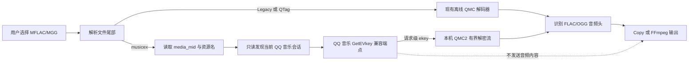

# QQ 音乐 MFLAC / MGG 支持与逆向分析报告

- 日期：2026-08-21
- 目标版本：Kugo Music Converter v0.6.1
- 验证客户端：QQ 音乐 PC 22.52（x86）

## 结论

v0.6.1 已增加 `.mflac` 和 `.mgg` 支持，并覆盖两类文件：

- 旧式、尾部内嵌 ekey 的 QMC2 文件继续使用现有离线解码器；
- 新式 `musicex` 文件从尾部读取资源标识，通过当前用户已登录的 QQ 音乐会话调用 QQ 音乐运营的未公开 GetEVkey 兼容端点取得请求级 ekey，再在本机流式解密。

真实验收使用 QQ 音乐 22.52 生成的一份 MFLAC 和一份 MGG。两份文件均成功完成 `musicex` 解析、会话发现、兼容端点取钥、QMC2 解密和音频头识别，输出分别为 FLAC 和 OGG。测试过程未打印或持久化 UIN、`authst` 或 ekey。

## 项目现状

Kugo Music Converter v0.6.1 延续 Go + Wails v2 Windows 桌面架构。正式转换路径为：

```text
Wails 前端
  -> App.StartConversion
  -> handler.ConvertLocalPaths
  -> service.DecryptService
  -> 音频头识别
  -> Copy 或 FFmpeg 转码
```

仓库在本次修改前已经具备：

- `unlock-music.dev/cli v0.2.12` 的传统 QMC 和旧式 QMC2 解码能力；
- 自研并经过向量/真实文件回归的 EncV1、EncV2、MAP 和分段 RC4；
- 请求级内存密钥模式，可作为 modern QMC 设计参考。

因此本次不重写密码算法，新增内容集中在 QMC 容器解析、QQ 音乐会话取钥和批处理集成。

## 文件格式证据

### musicex 尾部

QQ 音乐 22.52 的已完成 MFLAC/MGG 文件比下载缓存负载严格多出 192 字节；追加前的全部字节与缓存文件一致。尾部布局如下：

| 相对偏移 | 长度 | 含义 |
|---:|---:|---|
| `0x00` | 4 | song id，LE32 |
| `0x04` | 4 | quality / rate 字段 1 |
| `0x08` | 4 | quality / type 字段 2 |
| `0x0C` | 60 | `media_mid`，UTF-16LE，NUL 结束 |
| `0x48` | 68 | 资源文件名，UTF-16LE，NUL 结束 |
| `0x8C` | 36 | 保留/不透明字段，不作为密钥解释 |
| `0xB0` | 4 | 尾部总长度，LE32，当前为 `0xC0` |
| `0xB4` | 4 | 版本，LE32，当前为 `1` |
| `0xB8` | 8 | `musicex\0` |

音频加密负载长度为 `file_size - footer_size`。实现严格校验尾部边界、版本、UTF-16LE 终止符、代理对、资源基本文件名和 `.mflac/.mgg` 扩展名，并以有界 reader 保证尾部不会进入输出流。

### 容器分流

| 类型 | 识别方式 | 密钥来源 | 处理方式 |
|---|---|---|---|
| Legacy / raw ekey | 尾部 LE32 长度或静态 QMC | 文件内嵌或静态掩码 | 现有 `qmc.NewDecoder` |
| QTag | BE32 长度 + `QTag` | 尾部内嵌 ekey | 现有 `qmc.NewDecoder` |
| STag | BE32 长度 + `STag` | 文件不含 ekey | 当前返回专用错误；不错误套用 QMC1 |
| musicex | LE32 长度/版本 + `musicex\0` | QQ 音乐运营的 GetEVkey 兼容端点 | 请求级 ekey + 有界 QMC2 流 |

## 客户端静态证据

本机验证的 QQ 音乐主程序和相关媒体模块均为 x86。`QQMusicCommon.dll` 是 media key 与解密逻辑的主要实现模块，22.52 样本可见以下导出 RVA：

| 导出 | RVA |
|---|---:|
| `EncAndDesMediaFile::ReadEncKey` | `0x133F2` |
| `EncAndDesMediaFile::SetEkey` | `0x13643` |
| `EncAndDesMediaFile::Open` | `0x1369D` |
| `EncAndDesMediaFile::Read` | `0x137B5` |
| `GetFileKeyValue` | `0x1DB14` |
| `GetFileKeyMap` | `0x1DB21` |
| `GetKeyForDecrypt` | `0x2EF9E` |
| `DecryptCacheFile` | `0x3004E` / `0x30057` |
| `DecryptData` | `0x31FB8` |

`QQMusic.dll` 导入 `DecryptCacheFile` 和 `GetFileKeyValue`；`QQMusic_Protocol.dll` 导入 `GetFileKeyMap`；播放器模块导入流式解密接口。该证据说明协议层填充 key map、Common 模块负责密钥查找与解密、播放器负责消费解密流。

本项目没有加载这些 DLL，也没有调用固定 RVA。RVA 仅用于确认 22.52 的职责边界，避免把版本相关二进制接口作为正式依赖。

## 运行时取钥

新版文件本身不包含 ekey。可验证的 Windows 流程是：

1. 解析当前用户 `%APPDATA%` 下 QQ 音乐配置中的 UIN；
2. 从 QQ 音乐 `SetCookie.dat/_SetCookie.dat` 读取明确的 `authst` 字段；没有可用字段时，只读扫描同用户的 `QQMusic.exe` 和 `qmbrowser.exe`；
3. 使用 `PROCESS_QUERY_INFORMATION | PROCESS_VM_READ`，不申请写权限、不注入代码、不加载 QQ 音乐 DLL；
4. 将 `uin + authst + media_mid + filename` 发送到固定 HTTPS 端点；
5. 从响应 `req_1.data.midurlinfo[0].ekey` 取得 ekey；
6. 立即构造 QMC2 解密流，密钥仅存在于本批次 Go 后端内存。

请求协议：

```text
POST https://u.y.qq.com/cgi-bin/musicu.fcg
module = music.vkey.GetEVkey
method = CgiGetEVkey
platform = "27"
```

实现设置连接/总超时、禁止重定向、限制响应为 1 MiB，并分类处理未登录、会话过期、账号无资源权限、网络失败和协议异常。音频内容和本地路径不会进入请求。

## 数据流图



## 安全与隐私边界

- 仅读取当前用户、固定进程名的 QQ 音乐会话；
- 仅使用进程查询与内存读取权限；
- 内存扫描有总时限、总字节上限、1 MiB 分块和跨块重叠；
- HTTPS 主机固定为 `u.y.qq.com`，不跟随重定向；
- UIN、`authst` 和 ekey 不进入 WebView、配置、历史、CSV、诊断日志或磁盘缓存；
- 单文件取钥失败只影响该文件，混合批次中的其他格式继续转换；
- 旧式 MFLAC/MGG 和其他格式不触发 QQ 音乐网络取钥；
- 不使用 Frida、DLL 注入、辅助 EXE、固定函数偏移或管理员权限。

账号/设备绑定结论需要谨慎表述：当前证据能够确认密钥与账号会话及资源权限相关；请求中的 `guid` 为固定值，现有证据不足以证明强设备绑定。公开材料也只能确认旧版 19.51 仍内嵌密钥、部分平台 19.57 及后续使用 `musicex`，不能把 Windows 19.52 作为所有平台的绝对分界。

## 实现文件

- `backend/internal/algo/qmcfile/`：容器识别、`musicex` 解析、有界 QMC2 reader；
- `backend/internal/qmckey/`：会话发现、GetEVkey 客户端、错误分类；
- `backend/internal/service/transcode.go`、`backend/internal/handler/convert_qmc_flac.go`：MFLAC Copy 输出的严格 FFmpeg 校验、末尾坏包检测、无损 FLAC 重建与复验；
- `backend/internal/service/decrypt.go`：legacy / modern 分流与请求级 ekey 解密；
- `backend/internal/handler/convert_qmc.go`：批次资源去重、逐文件密钥与错误隔离；
- `backend/app.go`、`backend/frontend/src/`：文件选择、扫描、徽章与隐私提示。

## 验证结果

已完成：

- `musicex`、QTag、STag、legacy 解析单元测试；
- 非法长度、版本、UTF-16LE、资源名和空 ekey 测试；
- MAP / RC4 多分块、128/5120 字节边界与尾部不输出测试；
- GetEVkey 请求结构、响应上限、错误分类和敏感值不进入错误测试；
- modern QMC 资源去重与混合批次失败隔离测试；
- Windows amd64 取钥包编译；
- QQ 音乐 PC 22.52 新增真实样本共 42 个：26 个 `musicex` MFLAC、16 个 `musicex` MGG，批量转换 42/42 完成；
- 16 个 MGG 直接输出 OGG，并通过 `ffmpeg -v error -xerror` 完整解码；
- 26 个 MFLAC 的原始解密 FLAC 均在已声明时长结束后出现一个末尾残缺包。应用现在会对 MFLAC Copy 输出做严格校验，检测到该模式后用内嵌 FFmpeg 无损重建 FLAC，并再次严格复验；
- 修复后的 26 个 FLAC 与 16 个 OGG 共 42/42 严格验证通过，stderr 为空，总输出约 1.06 GB；
- Wails CLI v2.14.0 已安装并完成 Windows amd64 开发构建；项目运行库仍按 `go.mod` 固定为 Wails v2.12.0。

真实文件、账号标识、会话和 ekey 未加入仓库或测试夹具。

## 公开来源与许可证

格式和协议事实参考：

- ownlight6/qmc-decoder，Windows GetEVkey 支持提交 `2833286132aa152cc123cc67c550c1df6e872973`；
- ownlight6/qmc-decoder，客户端版本与 `musicex` 说明提交 `bbef74d7c526f8934ed2f5aeac873fb74edb5e10`；
- ix64 QMC2 研究：<https://gist.github.com/ix64/bcd72c151f21e1b050c9cc52d6ff27d5>；
- Microsoft `OpenProcess`、`VirtualQueryEx`、`ReadProcessMemory`、Tool Help API 文档。

ownlight6/qmc-decoder 为 GPL-3.0。本项目本身同样以 GPLv3 发布，但本次没有复制或结构化翻译该项目代码；实现依据本机独立验证的文件/二进制事实、公开协议字段和 Microsoft Win32 文档编写。既有 QMC2 算法继续复用本仓库已有实现和既有许可证边界。

## 已知限制

- `musicex` 取钥依赖 QQ 音乐运营但未公开的客户端兼容协议，服务端字段或会话存储变化可能需要后续适配；
- QQ 音乐未运行、未登录或账号失去资源权限时不能取得 ekey；
- STag 文件当前只识别并明确报错，不通过不可靠的静态掩码生成损坏音频；
- 当前真实验收覆盖 Windows QQ 音乐 22.52，其他版本由容器与协议兼容性决定，不使用固定偏移保证版本适应性。
